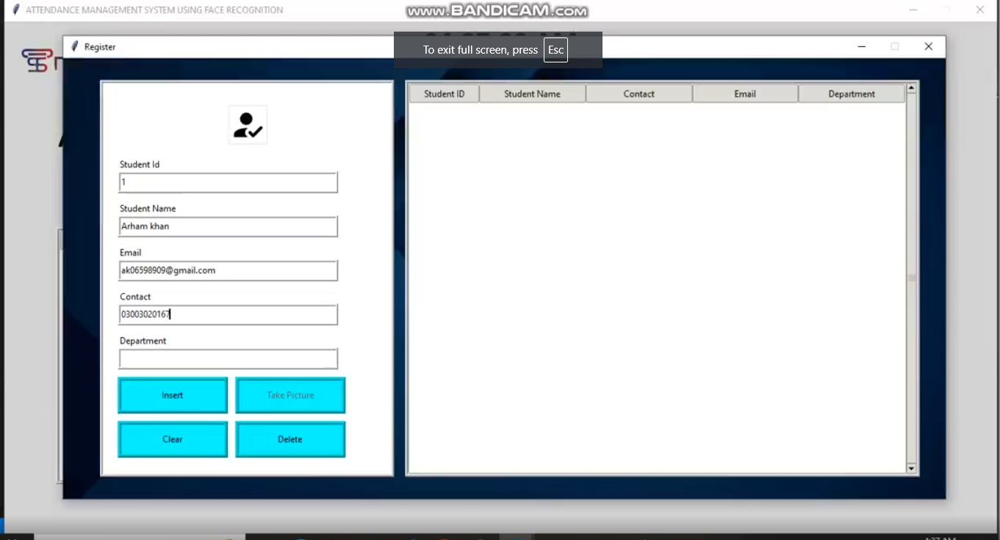

# 🎓 AI-Based Student Attendance System

[](https://www.linkedin.com/posts/ahmed-islam01_attendance-made-effortless-with-ai-in-activity-7234607907269484545-Ody0?utm_source=share&utm_medium=member_desktop)

Welcome to the **AI-Based Student Attendance System**! This project leverages facial recognition technology to streamline student attendance management, ensuring a hassle-free experience for educators and parents alike.

## 📚 Project Overview

The system consists of three main functionalities:

1. **Student Registration**:
   - New students can be registered using OpenCV.
   - Data is stored in JSON format, ensuring easy management and retrieval.
   - Upon successful registration, an email notification is sent to the student's parents.

2. **Attendance Tracking**:
   - The attendance of registered students is marked automatically when their faces are detected.
   - Utilizes Python’s Face Recognition API for accurate identification.
   - Attendance confirmation is sent via email to the parents.

3. **Final Report Generation**:
   - Generates attendance reports based on student ID.
   - Reports can be emailed to parents for their records.

## 📁 Repository Structure

```
.
├── .gitignore
├── LICENSE
├── README.md
├── Requirement.txt
├── Packages
│   └── [All required packages]
├── UIimages
├── images
├── JsonData
├── Harcascade_XML_FILE
├── Mainapplication.py
├── attend.py
└── registration.py
```

## ⚙️ Technologies Used

- **Python**
- **OpenCV** for facial recognition
- **JSON** for data management
- **SMTP** for email notifications
- **Tkinter** for the user interface

## 👥 Team Members

- **Arham Khan** (Lead)
- **Ahmed Islam**
- **Muhammad Hamza Khattak**
- **Rida Abid**
- **Tauseef Ahmed**

## 📄 License

This project is licensed under the MIT License - see the [LICENSE](LICENSE) file for details.

## 🙌 Contributing

We welcome contributions! If you’d like to contribute to the project, please fork the repository and submit a pull request.

---

Thank you for checking out our project! If you have any questions or feedback, feel free to reach out.
